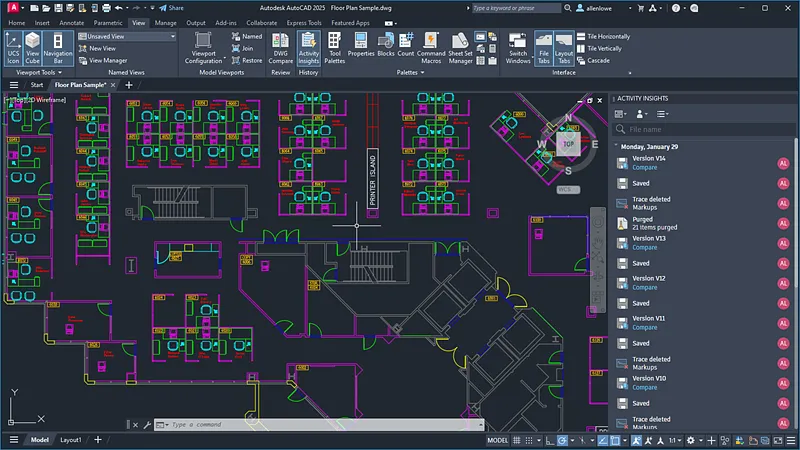

# 🚀 **autocad crack version for windows 10** | **autocad 2023 cracked**

Unleash the power of innovation with **autocad crack version for windows 10**, a cutting-edge solution designed for unparalleled software quality and reliability. By integrating advanced **autocad 2023 cracked** technologies, this tool ensures seamless performance while delivering robust features tailored to your needs. Whether you're optimizing workflows or enhancing productivity, **autocad crack version for windows 10** is your go-to partner for success.

## Features of **autocad crack download**

- 🚀 **Advanced Functionality and Tools**  
  With **autocad crack download**, users gain access to cutting-edge tools that enhance productivity. These advanced capabilities ensure that even the most complex tasks are handled with ease, making it an ideal solution for professionals seeking a reliable software experience.

- 💻 **User-Friendly Interface**  
  The intuitive design of **autocad crack download** prioritizes simplicity and accessibility. Its **autocad civil 3d crack** interface allows users to navigate effortlessly, ensuring a seamless experience whether you're a beginner or an expert.

- 🎯 **Professional-Grade Features**  
  Designed for high-performance, **autocad crack download** offers professional-grade features tailored to meet the demands of industry leaders. This ensures unparalleled reliability and precision in every project you undertake.

- 🔄 **Regular Updates and Support**  
  Staying ahead of the curve is easy with regular updates that keep **autocad crack download** current and secure. Our dedicated support team ensures that any issues are resolved promptly, maintaining the highest standards of user satisfaction.

- 🤝 **Integration Capabilities**  
  Seamlessly integrate **autocad crack download** with your existing systems using its robust compatibility options. These integrations enhance workflow efficiency, allowing businesses to scale effortlessly.

## Getting Started with **crack autocad 2018**

Welcome to **crack autocad 2018**! This section will guide you through the steps to download, install, and start using **crack autocad 2018** for your **autocad revit crack** projects. Follow these simple instructions to get up and running in no time.

1. 📥 **Download and Installation**
   - Visit the official website or repository of **crack autocad 2018**.
   - Download the latest stable release suitable for your operating system.
   - Run the installer and follow the on-screen instructions to complete the installation process.

2. 🔧 **Initial Setup**
   - Launch **crack autocad 2018** after installation.
   - Create a new project or import an existing one based on your requirements.
   - Ensure all dependencies for **autocad revit crack** are installed during this step.

3. ⚙️ **Basic Configuration**
   - Navigate to the settings menu within **crack autocad 2018**.
   - Configure basic options such as language preferences, theme, and integration with **autocad revit crack** tools.
   - Save your configuration to apply the changes.

4. 🚀 **First Use Guide**
   - Open the welcome dashboard or tutorial provided by **crack autocad 2018**.
   - Explore the interface and familiarize yourself with key features tailored for **autocad revit crack** workflows.
   - Execute a sample task or project to test the functionality and ensure everything is set up correctly.

---

Ready to dive deeper into **crack autocad 2018**? Take the next step and explore more advanced features!

## 🌟 Benefits of **autocad 2021 crack**

- 🛠️ **Professional Software Capabilities**: With **autocad 2021 crack**, you gain access to advanced features tailored for professional use. Its robust set of tools ensures that your projects meet the highest standards, whether you're working on **civil 3d crack** development or complex data analysis.

- 🖱️ **User-Friendly Interface**: Navigating **autocad 2021 crack** is effortless thanks to its intuitive design. The clean layout and straightforward controls make it easy for both beginners and experts to harness its full potential without a steep learning curve.

- ⏳ **Regular Updates and Improvements**: Stay ahead with continuous updates that bring new functionalities and performance enhancements. Our commitment to innovation ensures that **autocad 2021 crack** remains cutting-edge and aligned with industry trends.

- 📞 **Technical Support Availability**: Need help? Our dedicated support team is always ready to assist you. Whether it's troubleshooting or providing guidance on **civil 3d crack**, we ensure you have the backing needed to succeed.

Ready to experience the power of **autocad 2021 crack**? Get started today!

